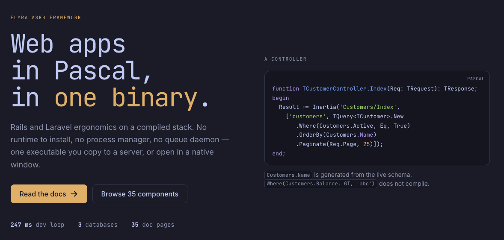

# Elyra Askr Framework

A full-stack application framework in Pascal. Rails-style ergonomics on
a compiled stack: **one binary, no sidecars**, and low resource use as
something you get for free while working as fast as you would in PHP or Ruby.

**Documentation: [askrcode.com](https://askrcode.com)** — which is itself an
Askr app, so the docs and the framework are never out of step.

[](https://askrcode.com)

```sh
askr new shop
cd shop
askr serve
```

The dev loop — edit, recompile, restart, serve — is measured at **247 ms**.

## Why it exists

A modern web app usually means a language runtime, a process manager, a queue
worker, a scheduler and a cache, each with its own configuration and its own
way of failing. Askr puts them in one executable you can copy to a server.

One idea holds the design together: **an arena per request**. Everything a
request allocates goes in a block that is reset in a single move when the
response is sent. No garbage collector, no reference counting in the hot
path, and memory that stays flat under load — there is a test that asserts
exactly that over 500 requests.

## What is in it

| | |
|---|---|
| **HTTP** | HTTP/1.1 server, routing, middleware, sessions, CSRF, TLS |
| **Urd** | Query builder and models for **Postgres, MySQL and SQLite**, with prepared-statement caching |
| **Norn** | Migrations, and typed columns generated from the *database*, not from the migrations |
| **Lauf** | The frontend layer: 38 Svelte 5 components, forms that know your validation, a data grid that sorts in the database |
| **Rún** | An optional query language transpiled to typed Pascal at build time |
| Images | What an upload really is, and resizing it with libvips |
| Runtime | Queue (in-process or durable), scheduler, cache, mail, logging, configuration |
| Security | Pure-Pascal crypto, password hashing, sign-in, gates, signed URLs |
| Agents | An MCP server: `askr mcp` compiles, tests, and answers about your routes, schema and docs |
| Desktop | The same app in a native window — WKWebView on macOS, WebKitGTK on Linux |
| AI | Claude over the Messages API: text, streaming, tools, structured output |

## A taste

```pascal
function TCustomerController.Index(Req: TRequest): TResponse;
begin
  Result := Inertia('Customers/Index',
    ['customers', TQuery<TCustomer>.New
       .Where(Customers.Active, Eq, True)
       .OrderBy(Customers.Name)
       .Paginate(Req.Page, 25)]);
end;
```

`Customers.Name` is a typed constant generated from the live schema, so a
misspelled column is a compile error and `Where(Customers.Balance, GT, 'abc')`
does not compile at all.

```svelte
<Form action="/customers" data={sent ?? {}} {errors}>
  <Field name="email" label="Email"><Input type="email" /></Field>
  <Button type="submit" variant="primary">Save</Button>
</Form>
```

The field finds its own error message by name, wires up `aria-describedby`
and `aria-invalid`, and the button shows a spinner while the request is out.

## Status

Phases 1 and 2 are complete on **macOS and Linux**, on **aarch64 and
x86_64**. The data layer is complete for all three dialects. The CLI has 26
commands. Documentation is 36 pages under [`docs/`](docs/).

Three things are **written and have never been run in earnest**, and they
will say so until someone runs them:

- **Windows.** The WebView2 binding is written and type-checked; nobody has
  started it on a Windows machine. It does not count as finished until they
  have. The next step there is a run, not more code.
- **The AI layer against a real API key.** What has been exercised against
  `api.anthropic.com` is a real call *without* a key, which came back as a
  401 with Anthropic's own error JSON, parsed correctly. That proves DNS,
  TLS, the request shape and the error path — not that a response with
  content comes back.
- **The Resend transport against a real API key.** Same story, same
  evidence: a real 401 from `api.resend.com`, its error JSON parsed into
  `EResendError`. No mail has been sent from here with a valid key.

## Getting started

Askr needs [Free Pascal](https://www.freepascal.org) 3.2.2 or newer. Node is
needed only for the frontend.

```sh
git clone git@github.com:kwhorne/askrcode.git
cd askrcode
./askr test          # the gate everything goes through
./askr cli           # builds the askr command
```

Then put `.build/bin` on your `PATH`, point `ASKR_HOME` at the checkout, and
create a project. [Getting started](docs/getting-started.md) has the rest.

## Versions

A project names the release it builds against, and `askr` fetches it:

```toml
# askr.toml
[askr]
version = "0.10.1"
```

```sh
askr install     # fetch it into ~/.askr/pkg
askr outdated    # what is published, and what you have
askr update      # move, after showing you what changes
askr version     # what this project actually builds against
```

`askr.lock` records the exact commit, and belongs in git. A cloned
project needs `askr install` before it will build — the lock names a
release, and the source for it is not in the repository.

A release is **one number across two ecosystems**: the Pascal source and
`@askrcode/lauf` on npm. If those drift apart you get a component whose
client half does not match its server half, and nothing says so until
something stops working — so the lock pins both, `askr install` writes
the matching npm version into `frontend/package.json`, and a test fails
if a checkout's two halves disagree.

[Versions](docs/versions.md) has the upgrade procedure step by step;
[`UPGRADE.md`](UPGRADE.md) has what changes between releases, and
`askr update` prints the relevant part of it before touching anything.

> `@askrcode/lauf` is **not on npm, by design.** Lauf ships inside the
> framework release, and `askr install` points your frontend at it
> through a gitignored symlink — so the version lives in exactly one
> place: the tag. Publishing would add a second one that can lag.

## Documentation

Start at [`docs/README.md`](docs/README.md). The pages worth reading first:

- [Getting started](docs/getting-started.md) — a project from nothing
- [Versions](docs/versions.md) — pinning a release, and upgrading
- [The arena](docs/arena.md) — the one idea the rest follows from
- [Database](docs/database.md) and [Models](docs/models.md)
- [Lauf](docs/lauf.md) — the frontend layer
- [Deployment](docs/deployment.md)

Every page also says what does **not** exist, and why. That part is not
marketing copy with the negatives removed; it is kept current.

## Development

```sh
./askr test        # build and run every suite
./askr test:amd64  # the same, built for x86_64 in a container
./askr check       # the same, with range and overflow checking on
./askr lauf        # the frontend suite
./askr lauf:check  # contrast and screenshots in a real browser
./askr db:up       # Postgres on 5433 and MySQL on 3308, for development
```

The code builds and passes on FPC **3.2.2** and **3.3.1 trunk**, and on
**aarch64 and x86_64**. All three are deliberate: they are the only way to
tell whether a limitation is gone or has merely moved — and the x86_64 gate
was added after a release that did not compile there at all.

`fpc` from `PATH` is used when present, or the one `ASKR_FPC` points at.
Otherwise the toolchain image from `tools/Dockerfile.fpc` is built.

## Licence

MIT. See [LICENSE](LICENSE).

Icons in Lauf are generated from [Heroicons](https://heroicons.com) (MIT);
the notice travels with them in
[`frontend/lauf/NOTICE.md`](frontend/lauf/NOTICE.md).
